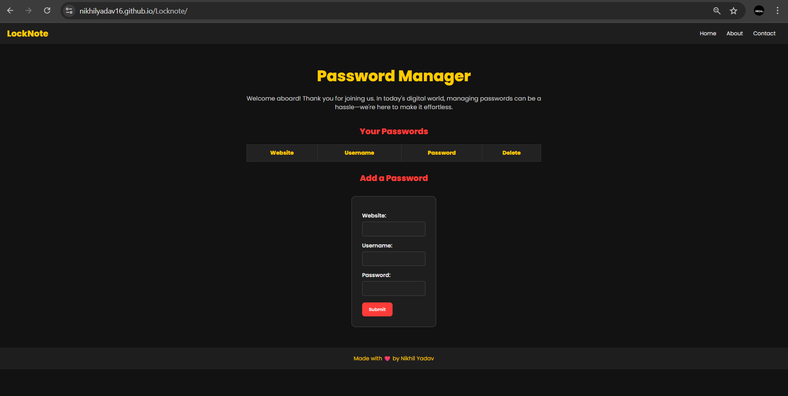

# Locknote

A simple and responsive **Password Manager** web application built with **HTML**, **CSS**, and **JavaScript**. This project allows users to securely store and manage their passwords along with associated website names and usernames. You can add and delete entries, with optional enhancement to use local storage.

---

## ✅ Features

- ➕ Add new password entries (Website, Username, Password)  
- ❌ Delete existing entries  
- 🌓 Clean and responsive UI  
- 💾 Local storage support *(optional enhancement)*  

---

## 🚀 Demo

You can view a live version of the project here:  
👉 [Live Demo](https://nikhilyadav16.github.io/Locknote/)

---

## 📁 Project Structure

```
Locknote/
│
├── index.html      # Main HTML structure
├── style.css       # Layout and visual styling
└── app.js          # Logic for adding, deleting, and managing stored credentials
```

---

## 🛠 Technologies Used

- **HTML5**  
- **CSS3**  
- **JavaScript (ES6)**  

---

## 📦 How to Use

1. **Clone the repository**

```bash
git clone https://github.com/nikhilyadav16/Locknote.git
```

2. **Navigate to the project directory**

```bash
cd Locknote
```

3. **Open in your browser**

Open the `index.html` file with any modern web browser to start managing your passwords.

---

## 🖼 Screenshot




---
